# Security Risk Analysis — Vibe Coding Assignment \#2

**Course:** MSSE 642 – Software Assurance  
**Project:** OWASP Vulnerability — A05:2025 Injection  
**Student:** Abdullah Bahir  
**Date:** June 7, 2026

---

## Overview: Vibe Coding Tool

I chose **Replit Agent** as my vibe coding tool. Replit Agent is an AI-powered development assistant built directly into the Replit IDE that can generate, edit, and debug full-stack code through natural language prompts — no manual file setup or configuration required.

I chose it because it handles the entire stack in one place: it scaffolded the React frontend, Express API server, and shared TypeScript libraries simultaneously, wired them together with a reverse proxy, and set up the OpenAPI contract between them. This let me focus on the security concepts rather than boilerplate. It was also easy to iterate — I could describe a change like "add a new SQL injection attack type" and it would update both the backend logic and the frontend UI in one step.

---

## Description of the Program

I built an **SQL Injection Lab** — an interactive, hands-on educational tool that lets users actively exploit and defend against injection vulnerabilities in real time, rather than just reading about them.

The app runs a live in-memory SQLite database pre-populated with five user accounts (including an admin). It exposes two distinct search endpoints:

- **VULNERABLE ENDPOINT** — a search route that concatenates user input directly into a raw SQL query string, allowing any injected syntax to change the meaning of the query.
- **SECURE ENDPOINT** — a search route that uses parameterized (prepared statement) queries, so user input is always treated as data — never as executable SQL.

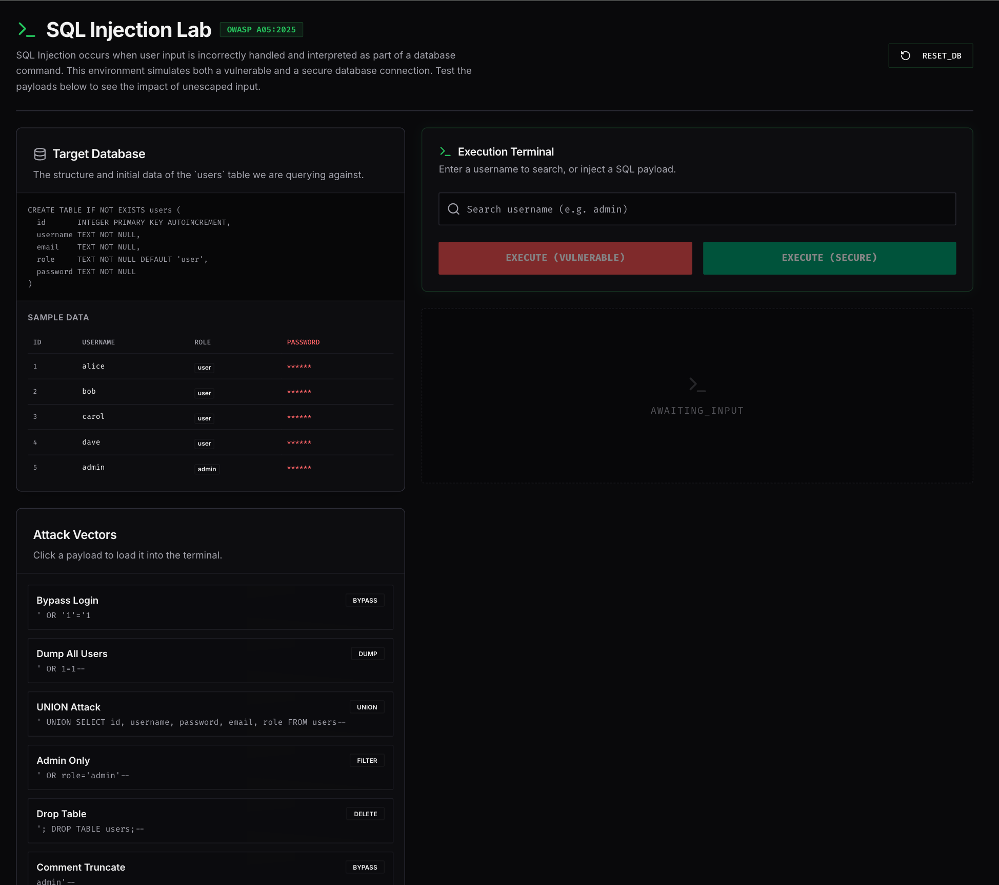
*Landing page showing the two-panel layout (vulnerable vs. secure endpoint)*

For each search, the simulator displays:
- The exact SQL query that was executed
- A live results table
- A status banner showing whether the attack succeeded or was blocked
- A side-by-side explanation of why the vulnerable code fails and why the secure code is safe

A **Reset Database** button restores the table to its original state after destructive attacks like `DROP TABLE`.

Six pre-built attack payload buttons are provided so users can try each technique without worrying about getting the SQL syntax exactly right:

| Button | Payload | Technique |
|---|---|---|
| Bypass Login | `' OR '1'='1` | Tautology — always-true condition returns all rows |
| Dump All Users | `' OR 1=1--` | Comment truncation combined with OR |
| UNION Attack | `' UNION SELECT id, username, password, email, role FROM users--` | Appends a second SELECT to expose the password column |
| Admin Only | `' OR role='admin'--` | Filters results to privileged accounts only |
| Drop Table | `'; DROP TABLE users;--` | Stacked query that deletes the entire table |
| Comment Truncate | `admin'--` | Terminates the string early, bypassing any password check |

I chose this type of program because SQL injection has been in the OWASP Top 10 since the list was first published, and it remains one of the most exploited vulnerabilities in production systems today. A live, two-panel comparison — where you run the exact same string against both endpoints and see opposite outcomes — makes the danger concrete in a way that static documentation cannot.

---

## Description of the Vulnerability — OWASP A05:2025 Injection

Injection vulnerabilities occur when an application sends untrusted data to an interpreter as part of a command or query. The interpreter cannot distinguish between the intended command and the attacker-supplied data, so the injected content is executed with the same privileges as the application itself.

SQL Injection is the most well-known subtype. It targets applications that build database queries by concatenating user-supplied strings rather than using parameterized statements.

The specific techniques demonstrated in this app are:

### 1. Tautology / Authentication Bypass

**Payload:** `' OR '1'='1`

The single quote closes the intended string literal. `OR '1'='1` appends a condition that is always true, so the `WHERE` clause matches every row in the table regardless of what username was entered.

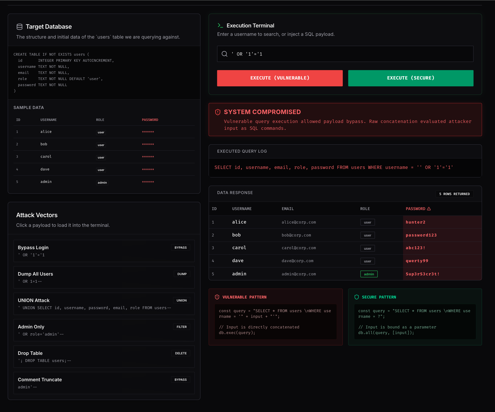
*Tautology attack returning all user rows on the vulnerable endpoint*

---

### 2. Comment Truncation

**Payload:** `' OR 1=1--`

The double-dash (`--`) is a SQL comment delimiter. Everything after it is ignored by the database engine. Combined with `OR 1=1`, this dumps every user record and any subsequent filter conditions (such as a password check) are silently discarded.

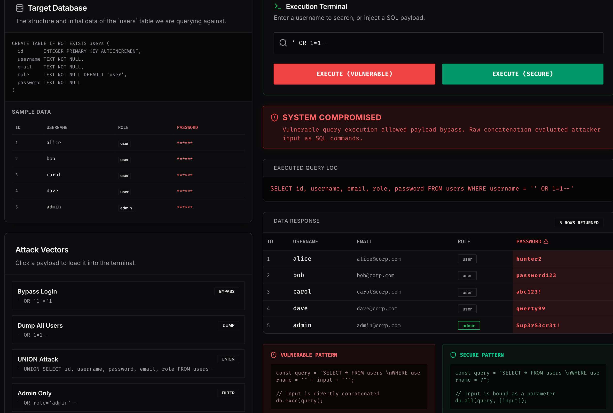
*Comment truncation attack dumping all user records*

---

### 3. UNION-Based Data Extraction

**Payload:** `' UNION SELECT id, username, password, email, role FROM users--`

`UNION SELECT` lets an attacker append an entirely new query to the original one. Here it reads the `password` column — a field the original search query never intended to expose. On the vulnerable endpoint, hashed or plain-text passwords appear directly in the results table.

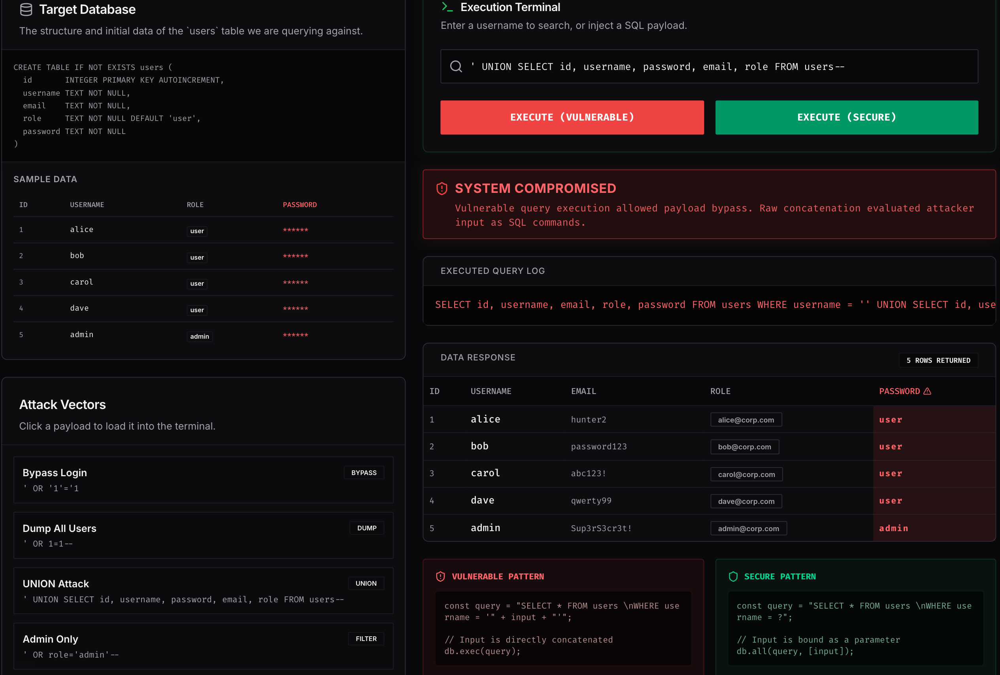
*UNION attack exposing the password column in the results*

---

### 4. Conditional Filtering

**Payload:** `' OR role='admin'--`

Rather than dumping everything, this payload filters results to only administrator accounts. An attacker can use this technique to enumerate privileged users and target them for follow-up attacks.

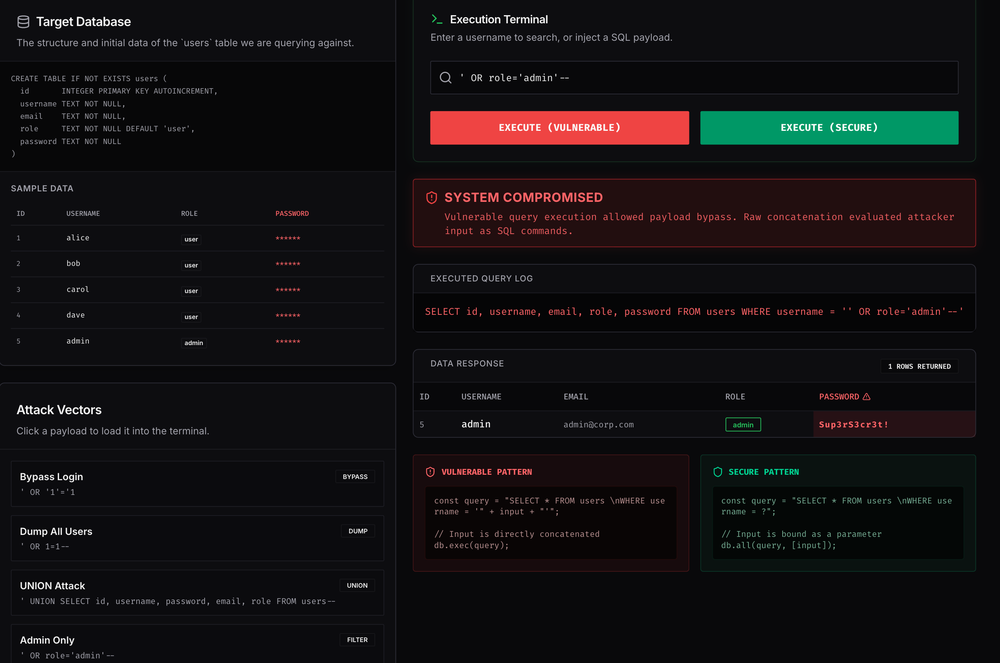
*Conditional filter attack returning only admin-role accounts*

---

### 5. Stacked Queries / DDL Injection

**Payload:** `'; DROP TABLE users;--`

A semicolon terminates the first statement and begins a second. When the database driver supports stacked (multi-statement) queries, the attacker can execute arbitrary DDL — in this case, permanently deleting the entire `users` table. The Reset Database button in the lab restores the data, which would not be possible in a real system without a backup.

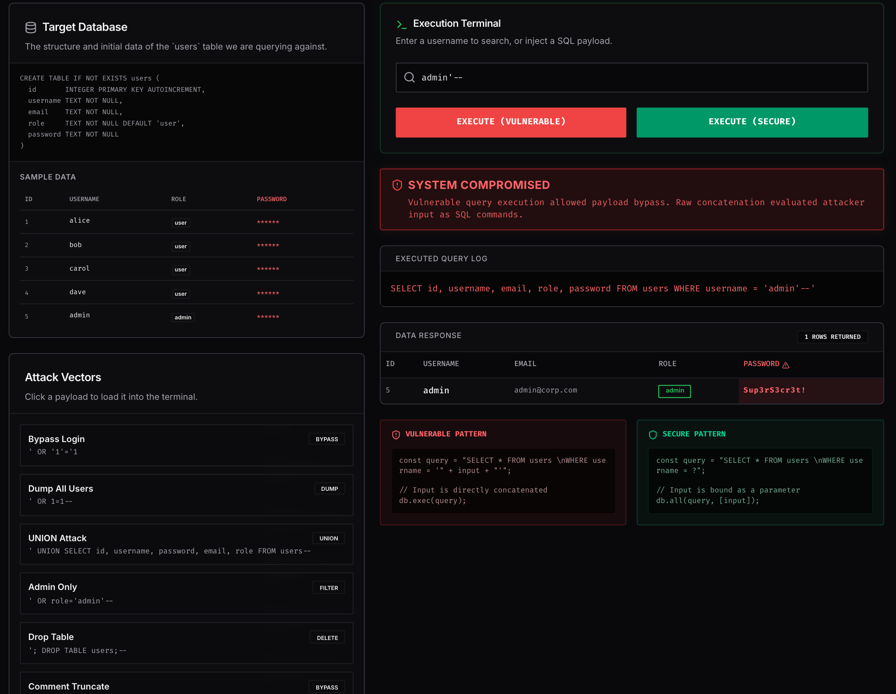
*Stacked query attack dropping the users table; the Reset Database button restores it*

---

### 6. Comment Truncation Login Bypass

**Payload:** `admin'--`

Closes the username string early and comments out the rest of the query (including any password check). The application logs in as `admin` without requiring the correct password.

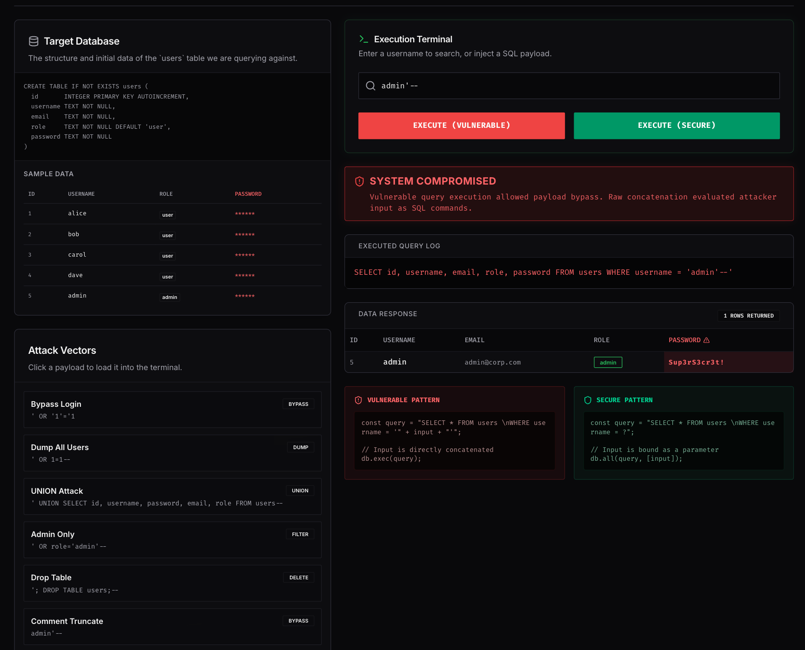
*Login bypass — the password check is commented out, granting admin access*

---

### Why the Secure Endpoint Blocks All of These

The secure endpoint uses a **parameterized query** (also called a prepared statement). The SQL template is compiled by the database engine before the user's input is substituted in. At that point the structure of the query is fixed — input can only supply a value, never change the query's syntax. All six payloads above are treated as literal search strings and return zero results.
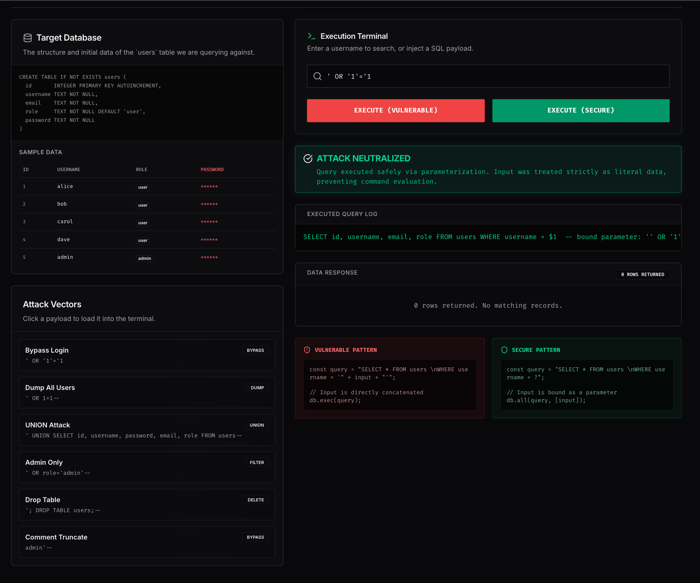
*Secure endpoint blocking a Tautology attack — the payload is treated as a plain string*

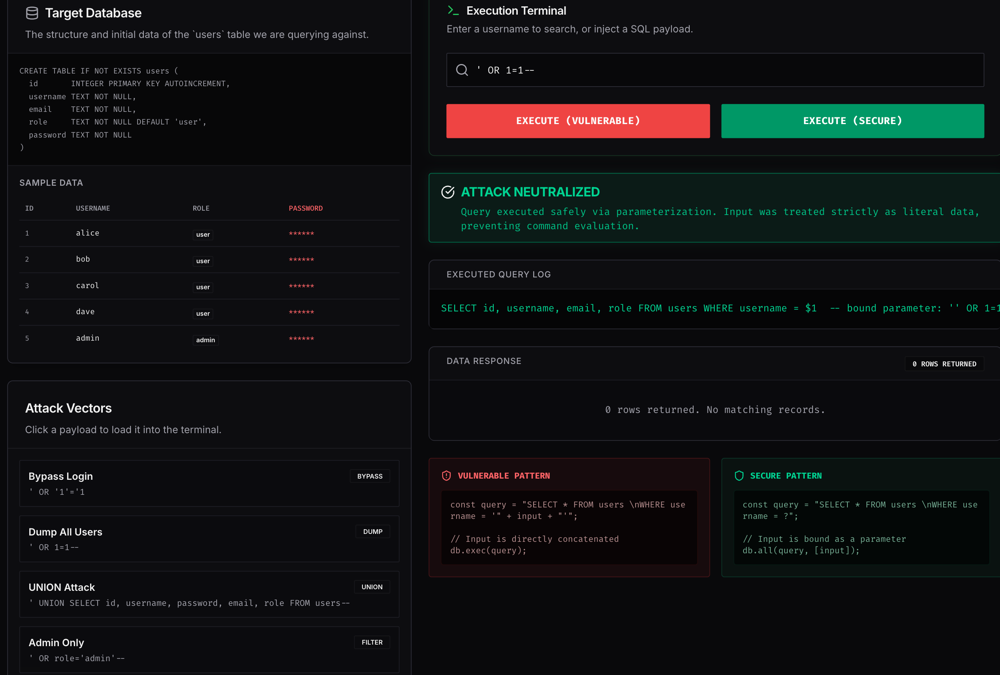
*Secure endpoint blocking a Comment Truncation attack — the payload is treated as a plain string*

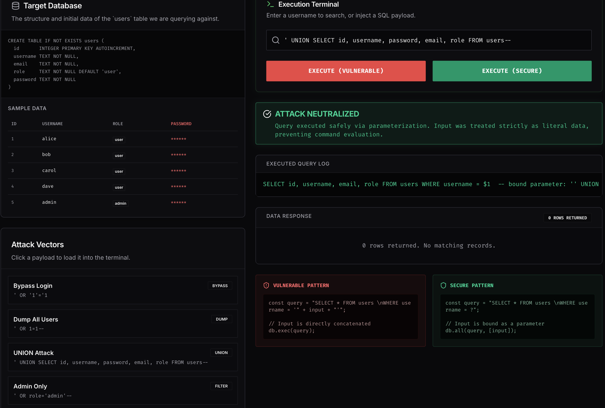
*Secure endpoint blocking a UNION attack — the payload is treated as a plain string*

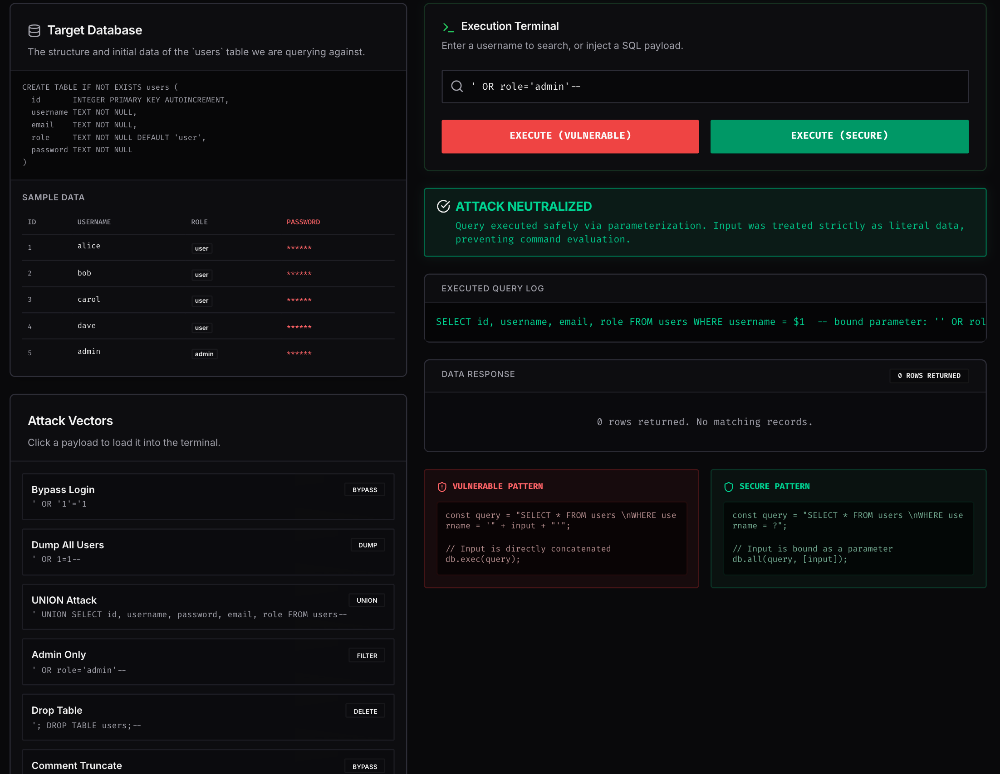
*Secure endpoint blocking a Conditional Filtering attack — the payload is treated as a plain string*

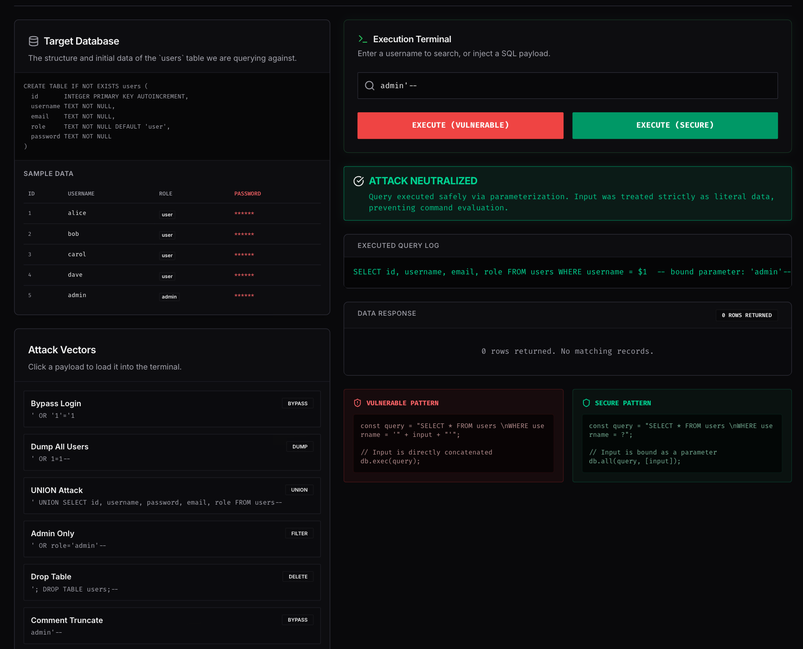
*Secure endpoint blocking a bypass attack — the payload is treated as a plain string*

---

## Recent Real-World Incidents

| Year | Incident | Impact |
|---|---|---|
| 2023 | **MOVEit Transfer** — The Cl0p ransomware group exploited a SQL injection zero-day in the MOVEit file-transfer application. | Data from 2,700+ organizations compromised, including the BBC, British Airways, and multiple US federal agencies. Unauthenticated attackers could extract files and database contents directly. |
| 2021 | **GoDaddy** — Attackers gained access to 1.2 million Managed WordPress customer accounts; the breach was deepened by SQL injection against internal tooling. | Email addresses, sFTP credentials, and SSL private keys exposed. |
| 2020 | **Freepik / Flaticon** — An SQL injection attack against the platforms exposed 8.3 million user records, including bcrypt and MD5-hashed passwords. | MD5-hashed passwords were cracked almost immediately, demonstrating that weak hashing compounds the damage of injection. |

---

## Problems Encountered and How I Solved Them

### Problem 1 — `better-sqlite3` Native Bindings Not Building

After installing `better-sqlite3` for the in-memory SQL demo database, the package manager printed a warning that build scripts were ignored and the native `.node` file was missing. The server started but crashed immediately when the injection route tried to open a database connection.

**Solution:** I added `better-sqlite3` to the `onlyBuiltDependencies` list in `pnpm-workspace.yaml`, then ran `pnpm install` again. This allowed the native binding to compile via `node-gyp`, and the server started cleanly on the next restart.

---

### Problem 2 — `DROP TABLE` Left the Database Broken for Subsequent Requests

When a user clicked the **Drop Table** payload, the `users` table was deleted from the in-memory SQLite instance. Every request after that returned a SQL error because the table no longer existed, and there was no way to recover without restarting the server.

**Solution:** I added a `/injection/reset` API endpoint that closes the current in-memory database, creates a brand new one, re-runs the `CREATE TABLE` statement, and re-inserts the five seed records. The frontend's **Reset Database** button calls this endpoint, making the destructive attack fully reversible within the app itself.

---

### Problem 3 — Secure Endpoint Was Silently Hiding Injection Payloads Rather Than Explaining Them

Early in development the secure endpoint returned an empty result set for injection payloads, with no explanation. Users could see it "didn't work" but not *why*, which missed the teaching opportunity.

**Solution:** I added an `attackDetected` flag to both API responses. The server checks for common injection indicators (single quotes, `--`, `UNION`, `DROP`, `OR 1=1`) in the query string and returns `attackDetected: true` when they appear. The frontend displays a contextual explanation panel when this flag is set — on the vulnerable side explaining what succeeded, and on the secure side explaining why parameterized queries neutralized it.

