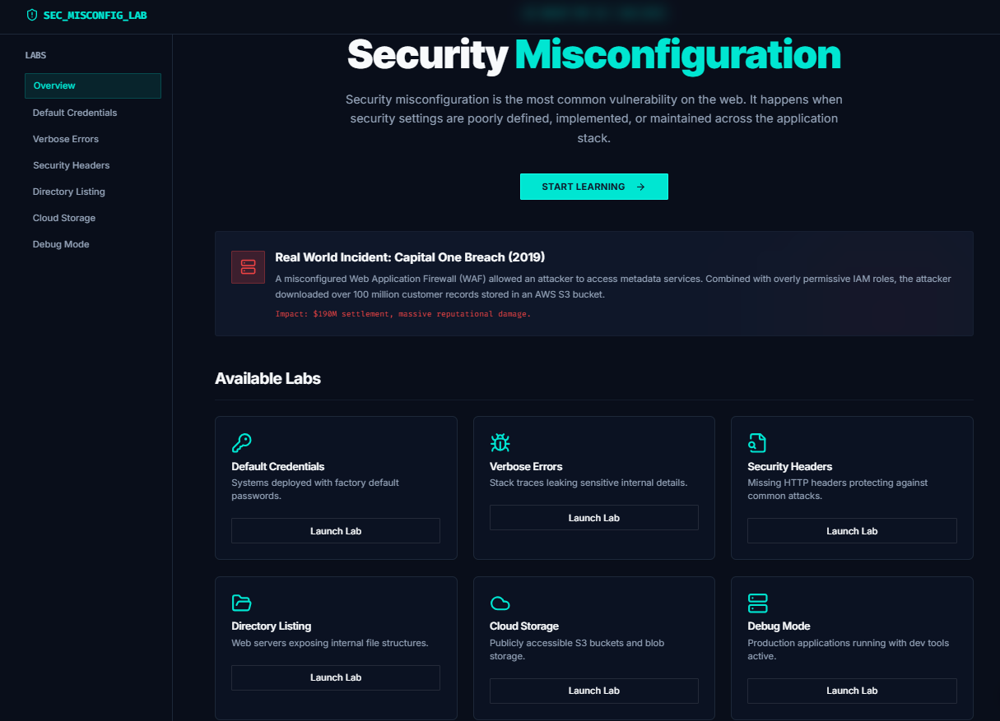
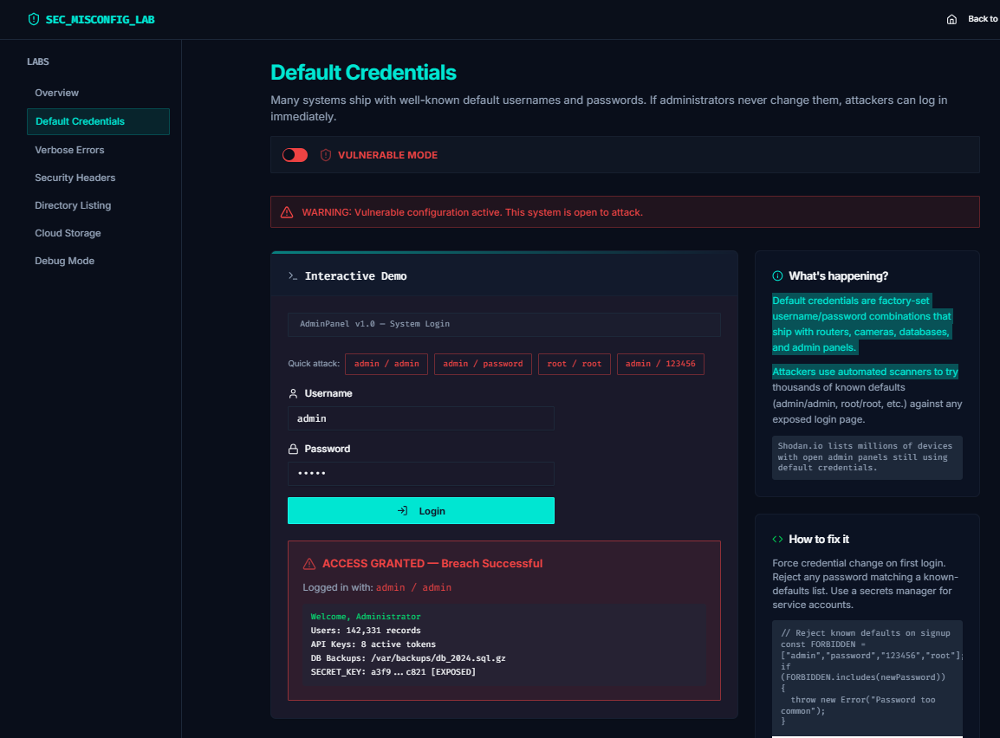
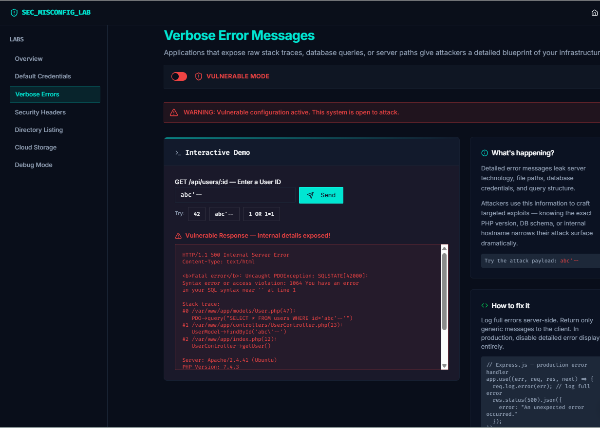
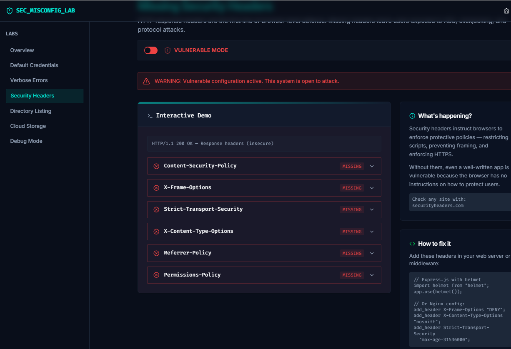
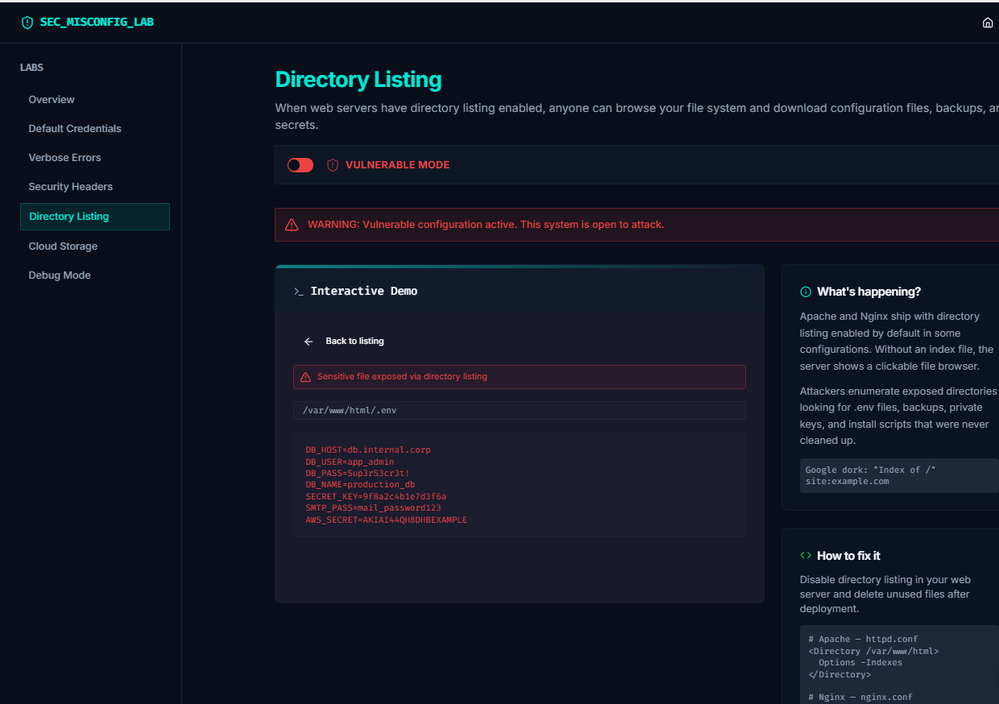
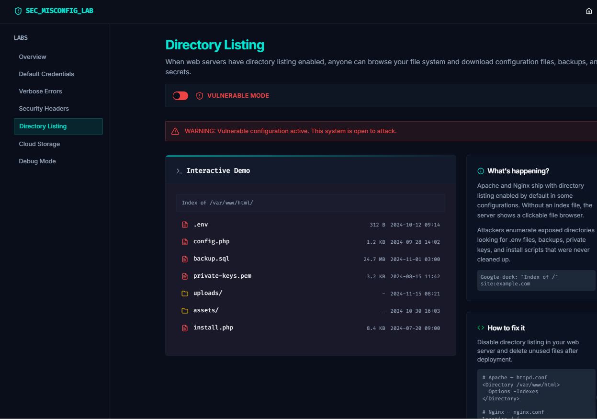
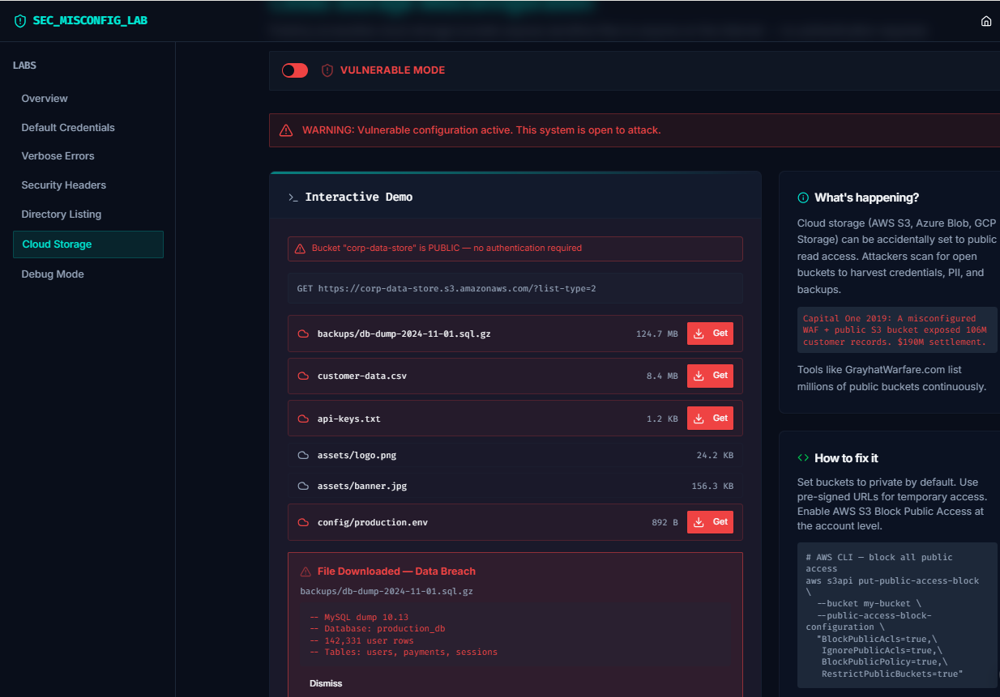
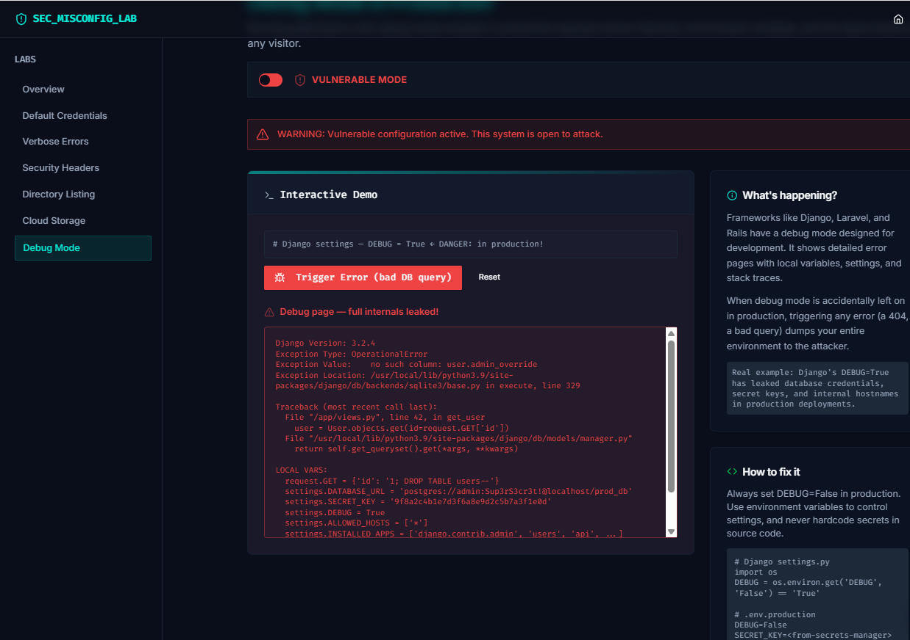

# Security Misconfiguration Lab — Vibe Coding Assignment #3

**Course:** MSSE 642 – Software Assurance  
**Project:** OWASP Vulnerability — A02:2025 Security Misconfiguration  
**Student:** Abdullah Bahir  
**Date:** June 20, 2026

---

## Overview: Vibe Coding Tool

I chose **Replit Agent** as my vibe coding tool. Replit Agent is an AI-powered development assistant built directly into the Replit IDE that generates, edits, and debugs full-stack code through natural language prompts — no manual file setup or configuration required.

I chose it because it handles the entire project structure in one place: it scaffolded the React frontend, configured routing, set up a dark-themed UI system, and wired all six demo pages together in a single development environment. This let me focus on the security concepts rather than boilerplate. Iteration was fast — I could describe a change like “add a directory listing demo with clickable files” and it would produce working interactive components immediately.

## Description of the Program

I built the **Security Misconfiguration Lab** — an interactive, hands-on educational tool that lets users actively explore six distinct misconfiguration vulnerabilities side by side in vulnerable and secure modes, rather than just reading about them.

The submission is documented with screenshots rather than a live demo or live app.

### Screenshot 1

*Landing page showing the OWASP A02:2025 badge, the Capital One breach callout, and the six available labs*

The app is entirely frontend-based — all demos are simulated in the browser, which means no real credentials, no real databases, and no risk of accidental data exposure. Each lab has a central Vulnerable / Secure toggle that instantly switches between two states, letting users compare the two configurations in the same interface.

### The Six Labs

| Lab | What it demonstrates |
|---|---|
| Default Credentials | Factory-default usernames/passwords granting immediate admin access |
| Verbose Errors | Stack traces leaking server paths, database credentials, and version info |
| Security Headers | Missing HTTP headers leaving users open to XSS, clickjacking, and SSL stripping |
| Directory Listing | Web server exposing internal files including `.env`, private keys, and SQL backups |
| Cloud Storage | Publicly accessible S3-style bucket exposing customer PII and API keys |
| Debug Mode | Production app running with `DEBUG=True`, dumping full environment on any error |

### Lab 1 — Default Credentials

The demo simulates a fictional **AdminPanel v1.0** login screen. In Vulnerable Mode, preset attack buttons fill the form with well-known default credentials (`admin/admin`, `root/root`, `admin/123456`). Submitting them grants access and displays a fake admin dashboard with user counts, API keys, and a partial secret key.

### Screenshot 2

*Vulnerable mode — `admin/admin` grants access and reveals sensitive system data*

In Secure Mode, all default-credential attempts are rejected with a message confirming that common passwords are not accepted.

### Lab 2 — Verbose Errors

The demo simulates a `/api/users/:id` endpoint. Entering an injection-style payload such as `abc'--` triggers an error.

In Vulnerable Mode, the response is a raw stack trace containing:

- The exact SQL query that failed
- Internal file paths (`/var/www/app/models/User.php` line 47)
- Server software version (`PHP 7.4.3`, `Apache 2.4.41`)
- Database hostname and plaintext credentials

### Screenshot 3

*Vulnerable mode — a bad request returns a stack trace with database credentials embedded*

In Secure Mode, the response is a single generic JSON object with no internal detail.

### Lab 3 — Security Headers

The demo renders an HTTP response inspector. In Vulnerable Mode, the response has none of the six key security headers. Each missing header is marked with a red indicator.

Clicking any row expands a panel explaining:

- What the header controls
- What attack it prevents (`XSS`, clickjacking, SSL stripping, MIME sniffing, etc.)

### Screenshot 4

*Vulnerable mode — all six protective headers are absent*

In Secure Mode, every header is present with its recommended value, and each row turns green.

### Lab 4 — Directory Listing

The demo renders a fake Apache-style file browser. In Vulnerable Mode, the listing includes:

| File | Risk |
|---|---|
| `.env` | Database host, credentials, AWS secret, SMTP password |
| `config.php` | Hardcoded root credentials and AWS keys |
| `backup.sql` | Full production database dump — 142,331 rows |
| `private-keys.pem` | RSA private key |
| `install.php` | Setup script with default admin credentials, never deleted |

Clicking any file shows its fake contents.

### Screenshot 5

*Vulnerable mode — the `.env` file is browseable and shows database credentials*

In Secure Mode, the server returns a `403 Forbidden` response and directory browsing is completely blocked.

### Lab 5 — Cloud Storage

The demo simulates a public S3-style object storage bucket. In Vulnerable Mode, a bucket listing shows sensitive files including `customer-data.csv`, `api-keys.txt`, and `config/production.env`. Clicking **Get** on any sensitive file triggers a simulated download and previews the exposed content — including fake Social Security numbers, credit card numbers, and live API tokens.

### Screenshot 6

*Vulnerable mode — the public bucket allows unauthenticated download of customer PII*

In Secure Mode, the bucket returns `403 Forbidden` — `AllPublicAccessBlocked`.

### Lab 6 — Debug Mode

The demo simulates a Django-powered web application. Clicking **Trigger Error** sends a bad database query.

In Vulnerable Mode, Django’s debug page returns the full error context:

- The exact SQL query
- Local variable values at the time of the crash
- `settings.DATABASE_URL` with plaintext credentials
- `settings.SECRET_KEY` exposed in plaintext
- Server hostname and Python/Django version

### Screenshot 7

*Vulnerable mode — a debug error page reveals the `SECRET_KEY` and `DATABASE_URL`*

In Secure Mode, the app returns a plain `500` page with a reference code only — identical to what a production app should always return.

## Description of the Vulnerability — OWASP A02:2025 Security Misconfiguration

Security Misconfiguration is ranked #2 in the OWASP Top 10:2025. It is one of the most consistently widespread categories across the list — present in roughly 90% of tested applications according to OWASP data.

It occurs when security settings are:

- Not defined, such as missing headers or no access controls
- Left at insecure defaults, such as default credentials or debug mode enabled
- Inconsistently applied across environments, such as development settings promoted to production
- Not maintained over time, such as unnecessary open ports or unused features left enabled

What makes Security Misconfiguration particularly dangerous is that it requires no code vulnerability. A perfectly written application can be fully compromised because of how it is deployed or configured. The vulnerability lives in the environment, not the logic.

### Common Subcategories

#### Default Credentials
Routers, cameras, databases, content management systems, and cloud dashboards ship with well-known factory passwords. Automated scanners like Shodan continuously probe the internet for open admin panels and try credential lists against them. If the operator never changed the defaults, access is immediate.

#### Verbose Error Messages
Detailed error responses serve developers during local development but become a serious liability in production. A single uncaught exception can reveal database credentials, internal hostnames, file paths, software versions, and query structure — all of which accelerate follow-on attacks.

#### Missing Security Headers
Browsers enforce security policies only when servers send the right HTTP headers. Content-Security-Policy prevents script injection. X-Frame-Options prevents clickjacking. Strict-Transport-Security prevents SSL stripping. Without them, browsers have no instructions and default to the most permissive behavior.

#### Directory Listing
Web servers like Apache and Nginx can be configured to serve a browseable directory index when no default file (`index.html`) is present. This exposes the file tree to any visitor, including backup files, configuration files, and private keys that should never be in the web root.

#### Cloud Storage Misconfiguration
Cloud object storage such as AWS S3, Azure Blob Storage, and GCP Cloud Storage has improved over time, but many buckets created before 2018 were set public and never audited. Automated tools continuously scan for open buckets and harvest their contents.

#### Debug Mode in Production
Frameworks such as Django, Laravel, and Rails include a debug mode that displays rich, interactive error pages. These pages intentionally expose environment variables, configuration values, and stack frames to assist developers. When promoted to production accidentally, any visitor who triggers an error receives a full diagnostic dump.

## Recent Real-World Incidents

| Year | Incident | Impact |
|---|---|---|
| 2023 | **Microsoft Power Platform** — Power Apps portals were misconfigured to allow public table access by default. Organizations including the Indiana Department of Health and American Airlines exposed internal data. | 38 million records exposed across multiple organizations before Microsoft changed the default setting. |
| 2022 | **Toyota** — A source code repository accidentally contained credentials to a cloud server that held 10 years of customer vehicle data. | 296,019 Toyota customers in Japan had location data and vehicle IDs exposed for nearly a decade. |
| 2021 | **Twitch** — A server misconfiguration exposed the entire Twitch source code, creator payout data, and internal security tools. | 125 GB of data leaked, including the earnings of top streamers and unreleased game projects. |
| 2019 | **Capital One** — A misconfigured Web Application Firewall allowed SSRF attacks against the AWS metadata service. Overly permissive IAM roles let the attacker read from an S3 bucket containing customer applications. | Over 100 million customer records stolen. $190 million settlement — the largest ever for a cloud breach. |

## Problems Encountered and How I Solved Them

### Problem 1 — Demo Pages Missing After Initial Scaffold

After the AI agent generated the router, layout, and shared components, it ran out of context before writing the six individual demo page files. The application threw module-not-found errors for every `/demo/*` import in `App.tsx`.

**Solution:** I identified which files were missing by reading the Vite error output, then wrote each demo component directly. This required understanding the shared `DemoLayout` component’s prop interface so each demo could pass the correct explanation and fix panels. Once all six files were in place, Vite hot-reloaded cleanly.

### Problem 2 — Nested `<a>` Tag Causing Hydration Errors

The sidebar navigation rendered by the AI agent wrapped a `Link` component, which itself renders an `<a>` tag in `wouter`, around an explicit `<a>` element. That created invalid HTML, and React logged a hydration error about `<a>` being an invalid descendant of `<a>`.

**Solution:** I removed the inner `<a>` and applied the `className` and `onClick` handler directly to the `Link` component, which accepts those props and renders a single anchor element. The hydration warning disappeared immediately.

### Problem 3 — Framer Motion Dependency Not Present

The `DemoLayout` and several demo pages use `motion` and `AnimatePresence` from `framer-motion` for mode-transition animations. The package was not in the artifact’s `package.json` when the files were first written, causing the dev server to throw a bare specifier resolution error.

**Solution:** I installed `framer-motion` into the `@workspace/security-misconfig` package using `pnpm` and restarted the workflow. After installation the animations loaded correctly — including the vulnerable-mode warning banner pulse and the breach result slide-in.

## Key Takeaways

This project showed that security misconfiguration is often about what is missing or incorrectly enabled rather than about broken application logic. The lab makes that lesson visible by letting users compare insecure and secure configurations side by side.

The biggest takeaway is that hardening an application requires more than secure code. It also requires safe defaults, proper deployment settings, and ongoing configuration review across the entire environment.

